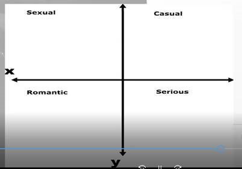
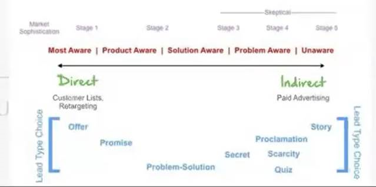

## 0) General Observations Before Opening:
Two categories: Group Dynamic and Specific Girl

### 1) Read group dynamic to gain insight into which logistical obstacles we’ll face
### 2) We read the specific girl to gauge her archetype before we start interacting with her
	a. Test theory if you are correct
	b. Find ways to test and disprove your theory/initial read of her archetype
### Group Dynamics
### 1) How is everyone interacting with each other? What can I interpret from that?
### 2) Reading their body language

	a. In which directions are they facing? Are their feet faced in a different direction than their upper body?
	
    b. Open or closed body language? And towards which direction?
 
    -> Example: Is her leg body language closed off away from a specific person? This will great insight into their current dynamic
### Reading the specific girl:
#### 1) What is she wearing?
#### 2) How does she respond to validation?

	a. Does she try to steal attention away from her friends?

	b. Does she lose interest when she receives validation?

    ---> Does her body language become closed off when she receives validation?
    ---> Does her attention drift elsewhere right after?
#### 3) If she is interacting with another guy, look at his actions and her reactions
	a. How does she respond to physical escalation?
	b. Is she mirroring him?
	c. What type of value does the guy display?
		i. Is it status? Preselection?
		ii. Or is he simply a very “safe” option?
			1. Anecdote of simp chodes pulling a lot in Budapest
### 4) Who releases tension first – the girl, or the guy?
	a. If the guy release tension first & the girl loses interest or compliance after – guy likely wasn’t dominant enough. And the reverse also holds true
### 5) What specific stimulus causes limbic responses (freeze, fight or flight?)
	a. This will give you great insight on how to game her
		i. Specific types of physical escalation to avoid
		ii. Certain words, actions or behaviors 
		iii. Her friend taking attention away from her (her friend amogging her – fear of loss)
### 6) What specific stimulus causes her to open up, or close off her body language?
	a. Similar to above, but different
		i. This is more indicative to what causes interest or disinterest, whilst limbic responses is more what makes her uncomfortable
### 7) Where does she look right after a limbic response, closing off her body language, or giving non-compliance?
	a. This will tell you a lot about which concerns/objections she will have
		i. For example – after a guy displays intent toward her, does she look towards one of her friends for approval?
			1. High probability for a cock block situation
			2. You have now gained insight into what the “Main Obstacle” will be (Column D)
				a. You have potentially identified the #1 priority you must handle, before you even entered the interaction!
		ii. Does she look towards another guy right after?
			1. Two probable scenarios: friendzoned guy in her circle (she feels guilt) or another guy she is interested in
				a. Different approaches for each and one of them. Look at other information, make a decision based on that
					i. Who breaks tension first? Who’s in chasing frame? Who mirrors who?
## 1) How did you open and what response did you get?
### 1) Try to be as accurate as possible
	a. What exact words did they use?
	b. What tonality?
### 2) Positive, neutral or negative response? – most important
	a. If positive – ask for more compliance
	b. If neutral – compliance test
	c. If negative – why?
		i. Figure out the underlying reason behind the negative response and calibrate!
			1. Make adjustments for the next interaction! Don’t make the same mistake twice!
### 3) Why this opener?
	a. You must be able to reason exactly why you used this opener
		i. Example from spreadsheet: I use the country cold read “Are you from x?” a lot
			1. This will open up two different paths for me – Open loop or DHV
			2. Accurate cold reads will give a lot of free compliance
				a. I realized very shortly that if the cold read wasn’t accurate, compliance would be far less if the cold read was inaccurate
					i. I started opening with “I’m actually really curious about something..”
						1. When they responded “About what?”, I could hear their accent = (probability for accurate cold read goes up)
 
## 2) What was the main obstacle in this interaction?
### 1) Which objection? Which concerns?
### 2) Has to be identified ASAP!!!
	a. Logistical issue?
		i. Cockblock?
		ii. Friends birthday?
		iii. Another guy?
		iv. She has a flight in the morning?
		v. Etc.
	b. Emotional concern?
		i. Period?
		ii. Too high value?
		iii. “I don’t do ONS”
		iv. “I want a relationship”
		v. Fear of judgement
		vi. Etc.
	c. “Your friend is not going to be fucking weird if we go together later right?”
## 3) What did she respond positively to?
## AND
## 4) What did she respond negatively to?
### 1) You always want to be aware of what she is responding positively or negatively to. This is included to force you to be aware of it
	a. If you are able to accurately read & pay attention to what she responds positively to, you gain massive insight into her archetype
	b. This will allow you to make very informed decisions on how to move the interaction forward & build more compliance
### 2) Definition of “positive response”?
	a. Positive compliance! What causes her to become more compliant?
### 3) Definition of “negative response”?
	a. Negative compliance! What causes her to become less compliant?
### 4) Examples of what to pay attention to:
	a. How does she respond to validation, or validation strips?
	b. Does she prefer to talk about herself, or other people?
	c. How does she respond to sexualization?
		i. Is she compliant to sexual hoops?
			1. Which sexual hoops does she respond strongest to
				a. This will tell you which sexualization angle to pick – generally oral or dominance
	d. Which DHV’s did she respond well to?
		i. Sometimes, you can’t tell! They may hide their reactions!
		ii. But if she reacted out of proportion to a specific value trigger, make a mental note of it
	e. How does she respond to proximity?
		i. Does her body language open up, or does she become more attentive as you close proximity?
			1. You can make the guess that she will respond very well to dominance
	f. How does she respond to social pressure?
	g. How does she respond to physicality?
		i. Girls who don’t respond well to verbal escalation may sometimes respond better to purely physical escalation

## 5) What was the overall metaframe? (You need to hyperaware of the framing and the dynamic)

    a. What was the dynamic like?
		- Do your best to describe the dynamic
		-  Examples: Casual? Relationshippy? Romantic?
	b. Who was chasing?
	c. Was a sexual frame established?
		-  What was the sexualization angle?
## 6) How was this metaframe established?
	a. Which actions, behaviors & words created this dynamic/frame?
	b. Be as specific as possible!
		i. The more specific you are, the more likely you are able to recreate it in your next interaction! 
## 7) Why did you pick this metaframe?
   
	a. Why did you pick this sexualization angle?
    b. We will use the information what we gathered in Step 3 & 4 (positive & negative response)
    c. We will try to identify where she lies on the Sexual Awareness Chart
    d. We will try to identify where she lies on the Casual-Sexual-Romantic- Serious graph

	· Which type of dynamic will she be most complaint to?

	· Your goal when framing the relationship in the initial interaction is to identify which dynamic on the spectrum she will be most compliant to!
	 

 
 
	· The Metaframe is a big part of your value proposition
	· You should figure out where she lies on this chart to decide on which approach you will take
	· Example in the context of the “Type Routine”
	o Most aware – a girl who already identifies as a sub
		- You can be far more direct – “You look like you’d be a great sub”
		- She will IMMEDIATELY see value in your being Dominant. She will “buy” immediately if a “good product” is presented, because she already knows that she wants it!
	o Unaware – a girl who is completely unaware of the dom/sub dynamic. She may not even fully understand the appeal!
		- Gradually building commitment – “You are attracted to confident guys” – “Yes” “You like an experienced guy who is able to lead” “Yes”
			· Small, gradual commitments that eventually build up to the point where she can agree that she is a sub!
			· Leverage HER confirmation bias
		- Far more important to preemptive framing
			· Anti-Slutshaming 
			· Open mindedness
			· Framing “sub” as something very positive!
			· .. and so on!
 

 
	· Another way to say this:
	· Step 1. Figure out her “archetype” / what “product she wants”
		o My mental model of “archetype” = What she is responding positively/negatively + to her Sexual Awareness Level + where on the Relationship dynamic graph she is)
		o Although labels (“brat”, “validation girl” , “shit tester”) are helpful and can help answer the above, I don’t find it specific enough
		o Gradually building up your interpretations of her archetype as the interaction keeps going
	· Step 2. Make a value proposition that is EXACTLY the product she wants to buy! 
## 8) At which points did you encounter non-compliance?

	· If you consistently track where on the structure you typically experience non-compliance, or on which hoops, you will be able to easily identify your bottlenecks!

## 9) What do you think triggered it? (non-compliance)

	· We must form a theory about what the underlying reason behind the non-compliance was
		o If we don’t know why we can’t overcome it!
	· Example disqualification:
		o “Ok so I’m just gonna say this. I’m done with mediocre sex. I can’t enjoy sex if the girl isn’t 100% relaxed and comfortable. And since you’re not relaxed because of your 2nd day of period, I wouldn’t have sex with you right now. But don’t get me wrong, you’re absolutely my type and perfect for me. But I’d only have sex with you when you’re feeling relaxed.”

## 10) How do you think it could’ve been reverted?

	· At those points, what could you have done to regain compliance? 

## 11) When did the interaction end?

	· At which specific point on the imaginary Open-to-Close timeline did the interaction end?
	· This will allow you to pinpoint where your interactions end on a     consistent basis = indicative of Sticking point
		o Example: “Right after the Open-minded hoop”
		o Example: “After pushing innocent inexperienced frame”
		o Example: “Right after I accidentally DLV’d with ‘x’”

## 12) How did the interaction end?

	· Describe as accurately as possible HOW the interaction ended 
		o Example: “We need to go to the bathroom”
		o Example: You closed her
		o Example: I left because I wanted to keep gaming after I got compliance for the pull
		o Example: “I couldn’t overcome X objection/emotional concern after many attempts, so I decided to find another set”
		o Example: “She had to go to a birthday party so I grabbed her number instead”

## 13) How did you DHV, and was it appropriate to the metaframe?

	· Example of congruent: A girl who is “very aware” on the Sexual Awareness Spectrum, who already wants a “Sexual + Casual” frame on the graph
		o Threesome DHV story
		o Hardcore dominance sexual DHVs
		o Amogging guys and pulling their girls
		o I pulled this girl on Monday, this girl on Tuesday, that girl on Wednesday
	· If you ran these DHVs on a girl who:
		o More towards the “Unaware” end of the awareness spectrum, and AT THE MOMENT wants something Romantic + Serious – it would be very uncalibrated
			§ For this girl, you’d typically rather want to DHV through previous relationships rather than ONS you had yesterday
				· You can imply that your previous ONS have turned into longer term things
			§ Sexual DHVs will still work amazingly, but you need to be more careful not to trigger concerns
		o Both girls will perceive value with all the these DHVs, but one is more likely to trigger concerns with one type of girl
		o The metaframing needs to be congruent and believable! If not, it’s going to break trust and blow up the interaction!
	· Were your DHVs “congruent” with the metaframe?
		o Example of congruent: A girl who is “Unaware” on the Sexual Awareness Spectrum, who already wants a more “Romantic” frame on the graph
			§ We are not going to lie to her about wanting a relationship or have a non-sexual frame, so we’re going to find an angle or a frame that makes her emotionally compelled to still go with you tonight
			§ Example: French girl framing – “I want to be your boyfriend for tonight”
			§ Set he frames previously mentioned
	· Which DHVs did you use?
		o Example: Ex-girlfriend German model
		o Example: Stripper ex threesome hunting
		o Example: 10-15 oral orgasms

## 14) Which qualities did you make her qualify? How did you do it?

	· Only get her to qualify on character traits that will help you move the interaction forward
	· Be hyperaware of how this affects the metaframe
		o If you get her to qualify on wife-material, you’re creating Commitment Biases around that for her!
		o She’s now going to be more probable to want something more towards the “Serious” end on the graph
		o The other way around, creating small, gradual agreements that imply or lead towards “ONS being something positive” can cause her to move further towards the end of the graph!
	· Write down the traits she qualified on, and the Commitment biases you created!
		o Open minded
		o Craziest thing she’s ever done
		o Adventurous
		o Spontaneous
